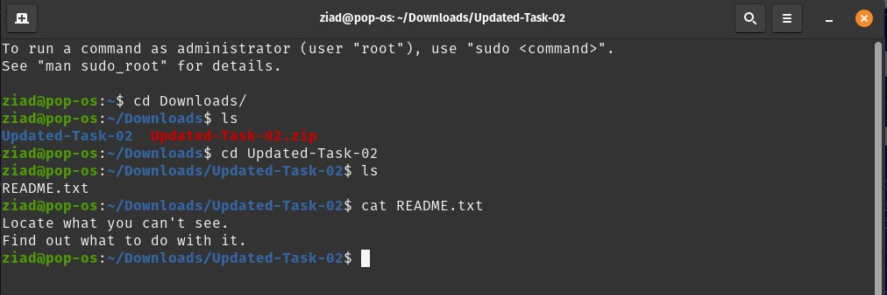
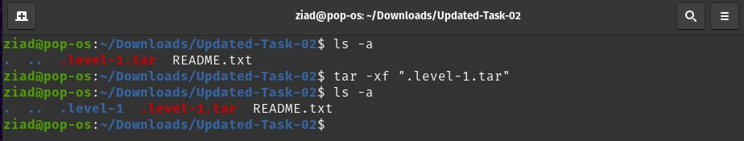
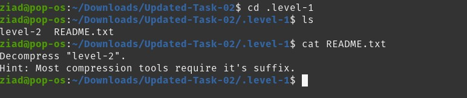
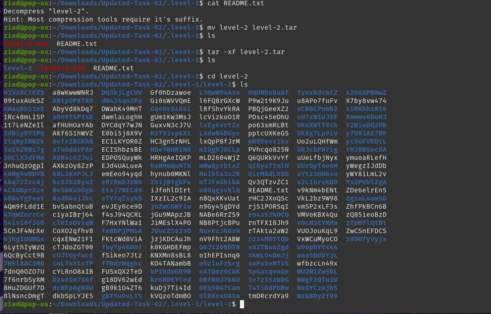
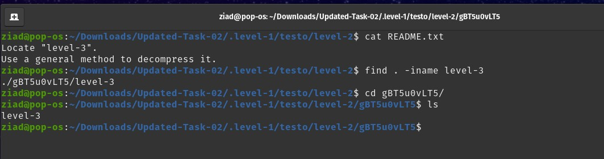
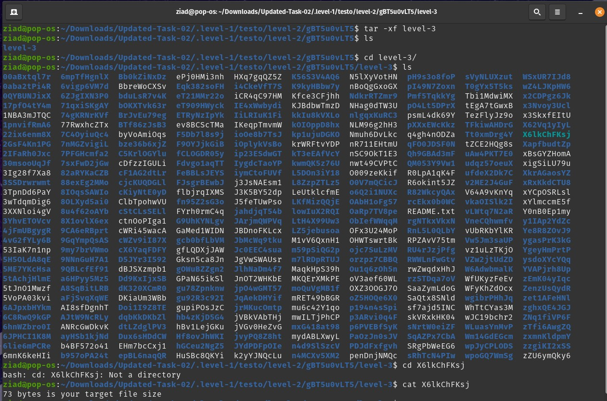
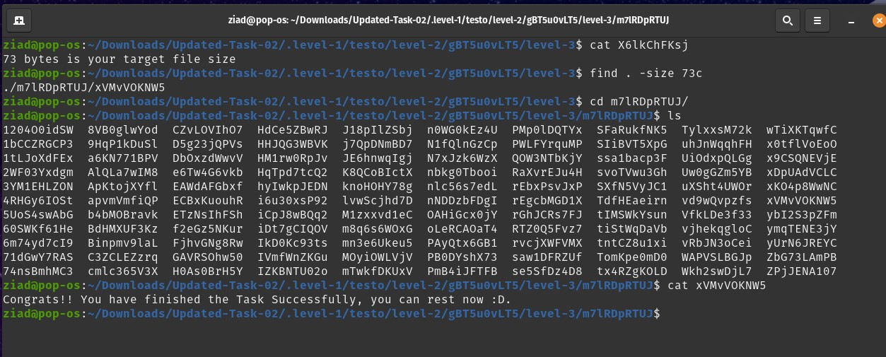

# Session 2 Task

---
---

## 1. Opening the Task Folder



```bash
cd Updated-Task-02
cat README.txt
```

---

## 2. Locating and Extracting the Hidden File



```bash
ls -a 
tar -xf ".level-1.tar"
ls -a
```

---

## 3. The Second Task



```bash
cd .level-1
ls
cat README.txt
```

---

## 4. Decompossing the File



```bash
mv level-2 level-2.tar
ls
tar -xf level-2.tar
ls
cd level-2
ls
```

---

## 5. Locating the Third Task



```bash
cat README.txt
find . -iname level-3
cd gBT5u0vLT5/
ls

```

---

## 6. Locating the Forth Task



```bash
tr -xf level-3
ls
cd level-3/
ls
cat X6lkChFKsj

```

---

## 7. Getting the Final Result



```bash
find . -size 73c
cd m7lRDpRTUJ
cat xVMvVOKNW5
```

---
