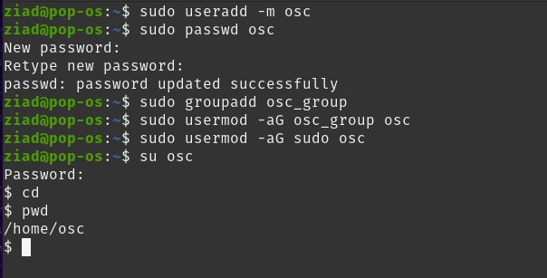
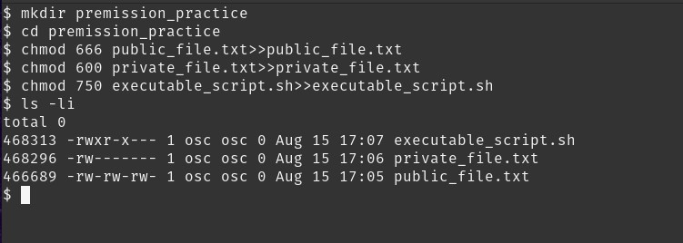
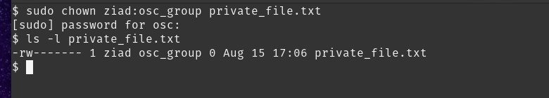
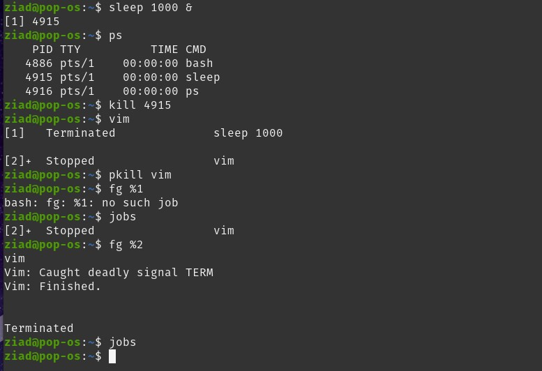
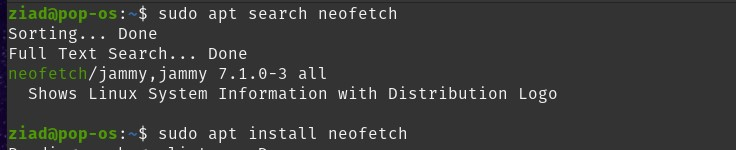
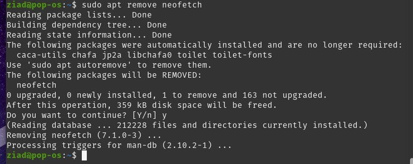

# Session 3 Task

---
---

## 1. Create a new user and a group



```bash
sudo useradd -m osc
sudo passwd osc
sudo groupadd osc_group
sudo usermod -aG osc_group osc
sudo usermod -aG sudo osc
su osc
cd
pwd
```

---

## 2. Change the permissions of a file



```bash
mkdir premission_practice
cd premission_practice
chmod 666 public_file.txt>>public_file.txt
chmod 600 private_file.txt>>private_file.txt
chmod 750 executable_script.sh>>executable_script.sh
ls -li
```

---

## 3. Change the owner of a file



```bash
sudo chown ziad:osc_group private_file.txt
ls -l private_file.txt
```

---

## 4. Process management



```bash
sleep 1000 &
ps
kill 4915
vim
^Z
pkill vim
fg %2
jobs
```

---

## 5. Package management




```bash
sudo apt search neofetch
sudo apt install neofetch
sudo apt remove neofetch
```

---
